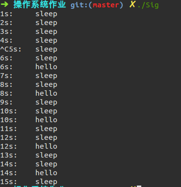

# 操作系统第一次作业
刘琎  
516020910128

## 文件列表
1. sig.c  
  信号实验程序，程序间隔1s打印一条`sleep`信息，当收到`SIGINT`之后每隔2s打印一条`hello`信息，实验效果如图所示：

  

  

2. MyCopy.c  
  使用`system calls：read、write、open`，实现通过`/MyCopy srcFile DesFile` 将srcFile文件的内容复制到 DesFile 中。实验效果如下图所示：

  

3. ForkCopy.c  
  创建两个进程，一个读取文件，另一个写入文件，通过exec交流实现复制文件。其中父进程将文件读入，然后不断以文件内容为参数创建子进程，并用exec调用`write_to_file`函数，直到所有内容复制完毕。实验效果如下图所示：

  

4. PipeCopy.c  
  创建两个进程，一个读取文件，另一个写入文件，通过Pipe交流实现复制文件。其中父进程将源文件读入，然后写入管道中，子进程从管道中读出内容，写入到目标文件中，实验效果如下图：

  

5. SockCopy.c  
  创建两个进程，一个读取文件，另一个写入文件，通过Socket交流实现文件复制。  
  由于使用了《深入理解计算机系统》提供的库<csapp.h>，因此编译时需要加上-lpthread，例如：  
  `gcc -o SockCopy SockCopy.c -lpthread`

  实验效果如下图所示：  

  

6. MyShell.c  
  实现简单的shell可以执行无参数指令，若执行含参数指令会报错。  
  编译命令：`gcc -o MyShell MyShell.c include/csapp.c -lpthread`   

  实验效果如下图所示：  

  

7. MoreShell.c  
  实现简单的shell，可以执行含有参数指令。  
  编译命令：`gcc -o MoreShell MoreShell.c include/csapp.c -lpthread`

  实验效果如下图所示：

  

8. DupShell.c  
  简单的shell可以执行含参数指令,并且实现管道功能，管道符前后要留有空格如`ls | wc`  
  编译命令：`gcc -o DupShell DupShell.c include/csapp.c -lpthread`

  实验效果如下图：

  

9. makefile  
  makefile文件。执行效果如下图：

  

10. include/csapp.h 和 include/csapp.c  
    《深入理解计算机系统》提供的头文件`csapp.h`以及实现文件`csapp.c`

11. srcFile.txt
    用于测试复制功能的输入文件。

